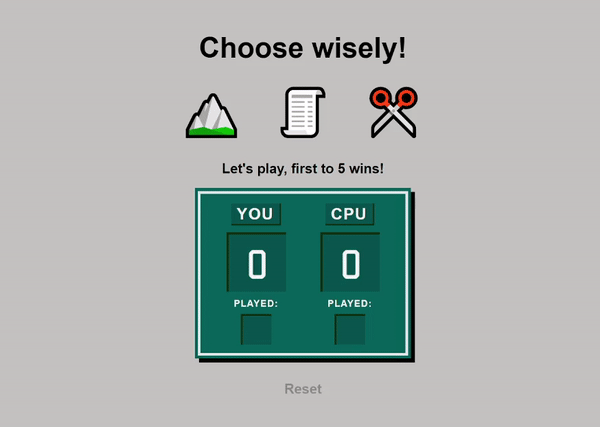

# rock_paper_scissors

<a href="https://kfig21.github.io/rock_paper_scissors/" target="_blank" rel="noopener noreferrer">View the project here!</a> 👀

<h3>Summary</h3>

 A Rock paper scissors game built with vanilla Js and styled with CSS, this project was built for The Odin Project JavaScript curriculum. The goal of this project was to learn DOM manipulation and variables in Javascript.

<h3>Demo GIF</h3>

<h4>Desktop</h4>

<h4>Mobile</h4>

-----------------------------

<h3>Thanks for checking out my project! Any && all feedback is appreciated!</h3>
